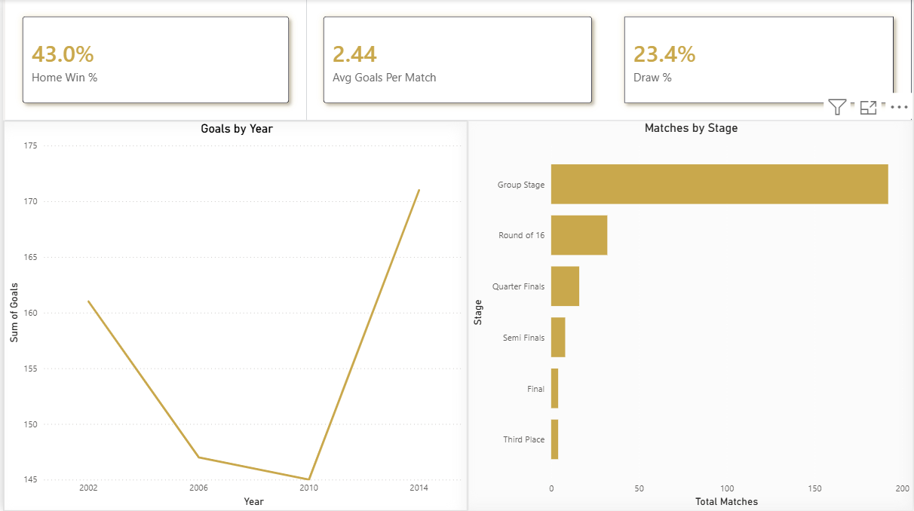
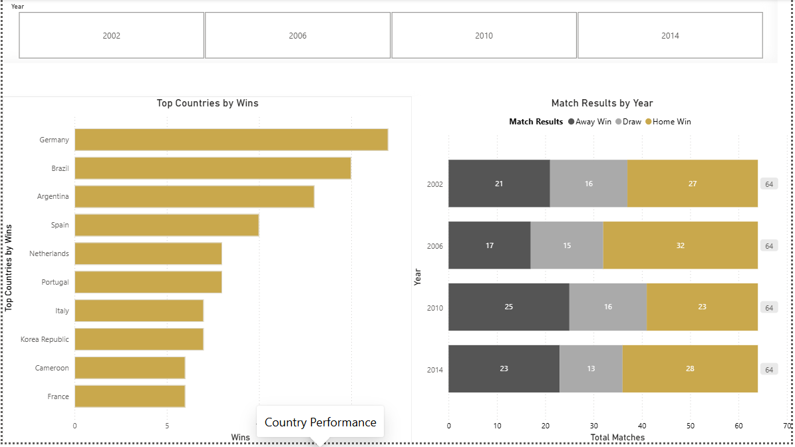
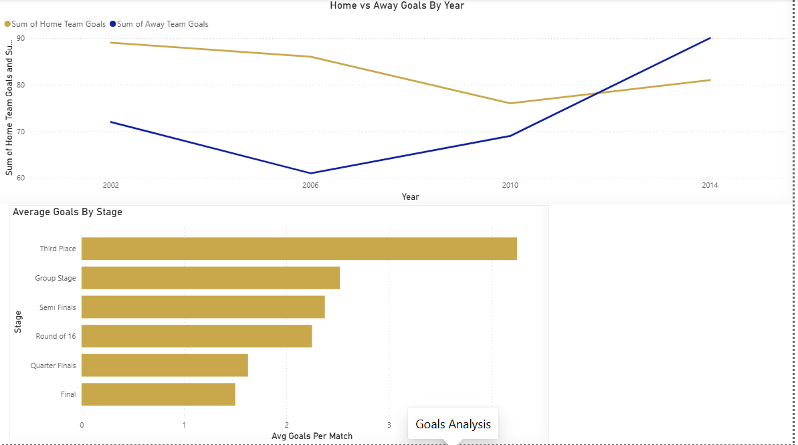
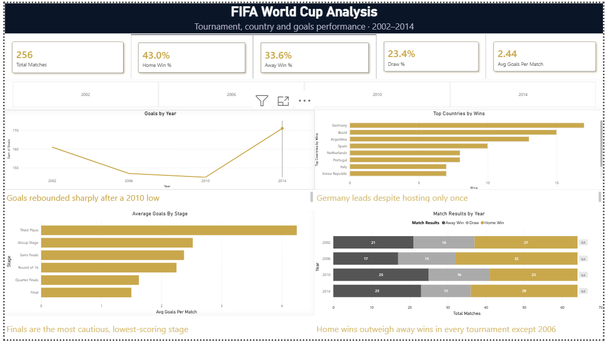

# FIFA World Cup Performance Dashboard

An interactive Power BI report analyzing 256 matches across four FIFA World Cup tournaments (2002 to 2014), built to answer three questions: what the overall tournament picture looks like, which countries performed best, and how goals told the story.



**At a glance:** 256 matches · 4 tournaments (2002 to 2014) · 4 report pages · ~43% home win rate · custom DAX measures

## Problem

World Cup match data is small and clean enough to model end to end (cleaning, DAX, and design) in a single project, while still raising real analytical questions. Does home advantage hold up across tournaments hosted in different countries? Are finals actually more cautious than earlier rounds? The answers aren't obvious from the raw rows, which is what makes it worth building a dashboard instead of just reading the CSV.

## Key Findings

| Finding | What the data shows |
|---|---|
| Home advantage is real and consistent | Home teams won ~43% of matches across all four tournaments, despite each one being hosted in a different country |
| Finals are the most cautious stage | Average goals per match are lowest in the Final and highest in the Third Place match: teams play tighter when the stakes are highest |
| Scoring dipped, then rebounded | Average goals per match fell to their lowest point in 2010 before climbing sharply by 2014 |
| Germany leads all-time wins | Germany tops total wins across this period despite hosting only one of the four tournaments |
| Away scoring caught up by 2014 | Home goals outpaced away goals from 2002 to 2010, but away-team scoring overtook home-team scoring for the first time in 2014 |

## Report Overview

| Page | Question It Answers | What's on It |
|---|---|---|
| **Tournament Overview** | What does the overall picture look like? | KPI cards, goals-by-year trend, matches by stage |
| **Country Performance** | Which countries performed best? | Top countries by wins, match results by year, year slicer |
| **Goals Analysis** | How did goals tell the story? | Average goals by stage, home vs away goals by year |
| **Summary** | All of the above, at a glance | KPI row, year slicer, and the four strongest visuals composed into one interactive view |

## Key Design Decisions

**Custom DAX, not default aggregations.** Win rate, home and away win percentage, and average goals by stage are all custom measures, so every figure on the report is defined explicitly rather than inherited from Power BI's defaults.

**Consistent design system, not default styling.** Every visual uses the same white card, soft shadow, and single accent color treatment, so the report reads as one product instead of a collection of charts.

**A summary page built on purpose.** The Summary page isn't a fifth arbitrary page. It's a deliberate composition of the strongest visual from each of the other three, so the dashboard's main story can be read in one screen.

**Known limitation, stated rather than hidden.** Country win totals are calculated from home-team appearances. A fully accurate per-country win count would require unpivoting home and away teams into a single dimension table. This was a deliberate scope decision for a four-tournament dataset, noted here rather than left for a reviewer to catch.

## Results

### Country Performance

Germany leads total wins across the period, and the year slicer lets you compare how match results shifted between tournaments.



### Goals Analysis

Finals produced the fewest goals per match, while home and away scoring converged by 2014.



### Summary

The four strongest visuals and a KPI row on one screen, controlled by a single year slicer.



## Tools & Technology

| Tool | Purpose |
|---|---|
| Power BI Desktop | Data modeling, DAX, report design |
| Power Query | Data cleaning and transformation |
| DAX | Custom measures for win rate, home/away splits, and stage-level scoring |

## Applications

- **Tournament Analysis**: compare scoring patterns, stages, and outcomes across tournaments
- **Home Advantage Research**: test whether hosting translates into results
- **Sports Reporting**: a template for one-screen match and performance summaries
- **Dashboard Design**: a reference for consistent, non-default Power BI styling

## How to Use

1. Download `WorldCupDashboard.pbix` from this repository.
2. Open it in Power BI Desktop.
3. If the data source path breaks, go to **Transform data → Data source settings** and point it to `data/WorldCupMatches-selected-columns.csv`.
4. Use the year slicer on the Country Performance and Summary pages to filter by tournament.

## Project Structure

```
├── WorldCupDashboard.pbix                     # Full Power BI report (all 4 pages)
├── data/
│   └── WorldCupMatches-selected-columns.csv   # Source dataset
├── images/                                    # Screenshots used in this README
│   ├── 01-tournament-overview.png
│   ├── 02-country-performance.png
│   ├── 03-goals-analysis.png
│   └── 04-summary.png
└── README.md
```
